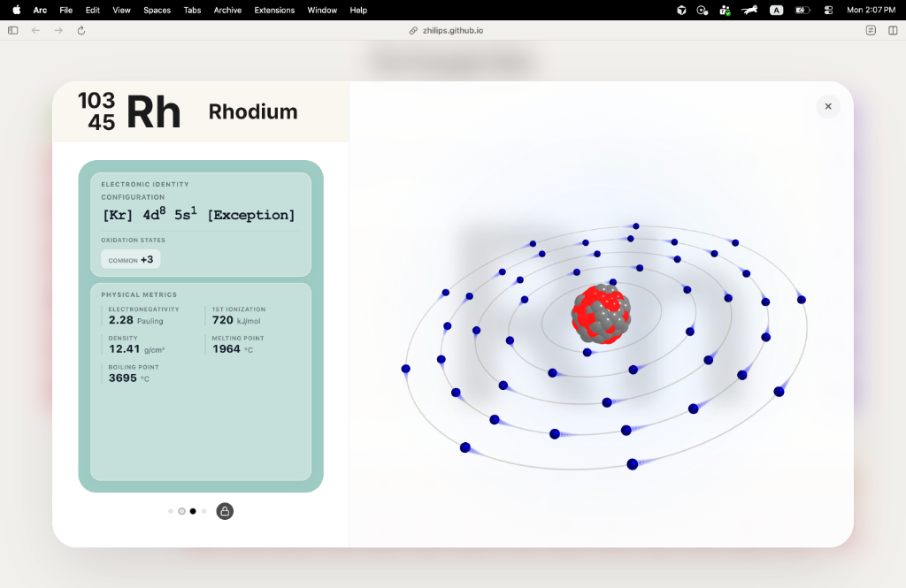

# 🧪 Interactive Periodic Table / 交互式元素周期表

A beautiful, interactive periodic table with 3D atomic models built using Three.js.

一个使用 Three.js 构建的精美交互式元素周期表，带有3D原子模型。



## ✨ Features / 功能

- **3D Atomic Models** - 旋转的电子云和原子核动画
- **Multi-level Information** - 从基础到高级的分层信息展示
- **Level Lock** - 锁定特定信息层级，在浏览不同元素时保持一致
- **Swipe Navigation** - 滑动切换信息卡片
- **Responsive Design** - 适配各种屏幕尺寸

## 🚀 Quick Start / 快速开始

1. Clone this repository / 克隆仓库
2. Open `index.html` in a browser / 在浏览器中打开 `index.html`

或者直接访问在线版本：**https://zhilips.github.io/Zperiod/**

## 📁 File Structure / 文件结构

```
├── index.html      # Main HTML structure / 主页面
├── style.css       # All styles / 样式文件
├── script.js       # Core logic & data / 核心逻辑和数据
└── three.min.js    # Three.js library / 3D渲染库
```

## 🎓 Educational Content / 教育内容

Designed for Grade 9-12 chemistry students, featuring:
- Atomic structure (protons, neutrons, electrons)
- Electron configuration
- Oxidation states
- Physical properties (density, melting/boiling points)
- STSE connections (Science, Technology, Society, Environment)

## 📜 License / 许可证

MIT License

---

Made with ❤️ using HTML, CSS, JavaScript & Three.js
